# Test

<h2>Используемые технологии:</h2>
<ul>
  <li>ASP.NET CORE</li>
  <li>Angular</li>
  <li>Entity framework CORE</li>
  <li>MS SQL</li>
</ul>
<h3>Перед применением нужно указать свой SQL сервер в AppSettings.json. Если базы данных не существует, то она создатся автоматически.</h3>
<h3>Можно импортировать БД TestDB.bak (в ней имеются все пользователи и загружено все тестовое множество картинок)</h3>
<h3>В папке Images находится тестовое множество картинок</h3>

<h1>Инструкция:</h1>
<h2>Найти человека:</h2>
Нажмите на кнопку выбрать файл, затем после выбора фотографии будет получен результат (иногда занимает несколько секунд).
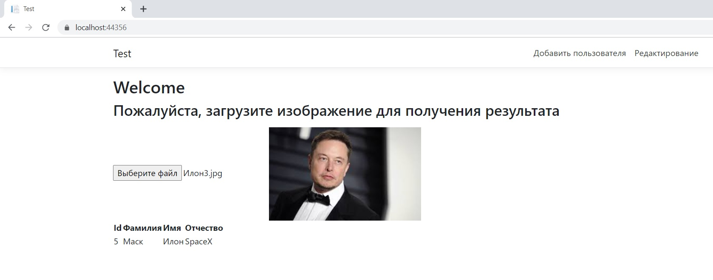

<h2>Найти человека по ФИО:</h2>
Нажмите на кнопку Редактирование (верхний правый угол), после чего введите ФИО (если поля ФИО оставить пустыми, то будет получен список всех пользователей в базе)
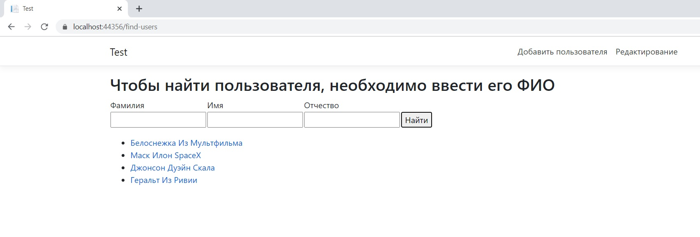

<h2>Узнать всю информацию о пользователе:</h2>
Переходите по ссылке выбранного вами пользователя, чтобы получить информацию о нем (id, ФИО, фотографии)

<h2>Изменить ФИО:</h2>
Нажмите на кнопку Изменить ФИО, после чего поля Фамилия, Имя, отчество станут доступны для редактирования. После изменений нужно нажать Сохранить. Если какое-нибудь поле оставить пустым, то оно примет значение Nullable (В консоли пришел статусный код 200 с сообщением об успешном сохранении) (Чтобы обновить результаты, нужно обновить страницу)
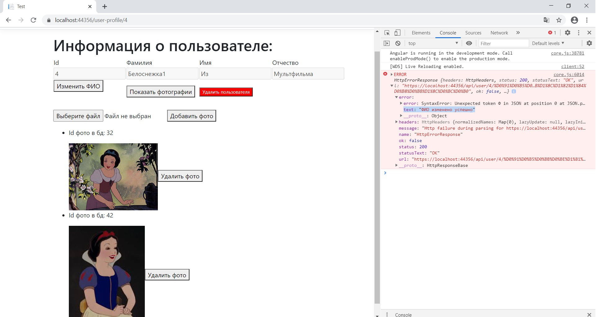

<h2>Удаление фото пользователя:</h2>
Нажмите на кнопу Показать фотографии, затем нажмите на кнопку удалить фото напротив того фото, которое собираетесь удалить. В консоли можно посмотреть результат. (Чтобы обновить информацию обновите страницу или нажмите еще раз на Показать фотографии)
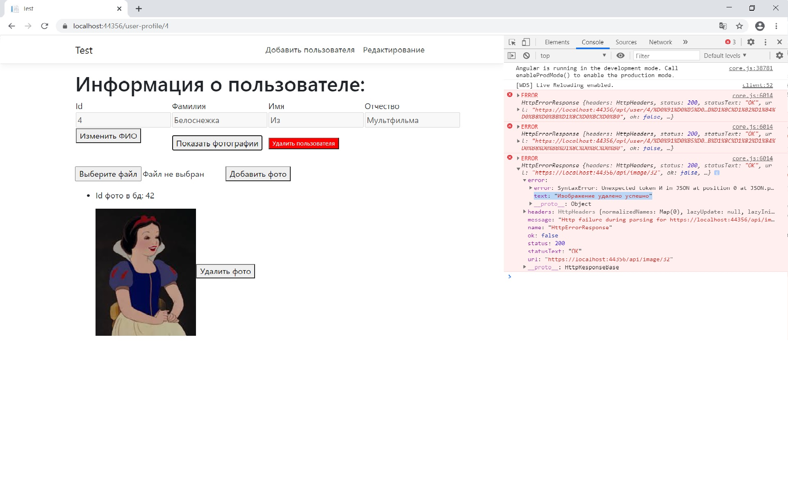

<h2>Добавление фото пользователя:</h2>
Нажмите на кнопу Показать фотографии, затем нажмите на кнопку Выберите файл. После выбора фотографии, нажмите на кнопку Добавить фото. В консоли можно посмотреть результат. (Чтобы обновить информацию обновите страницу или нажмите еще раз на Показать фотографии)
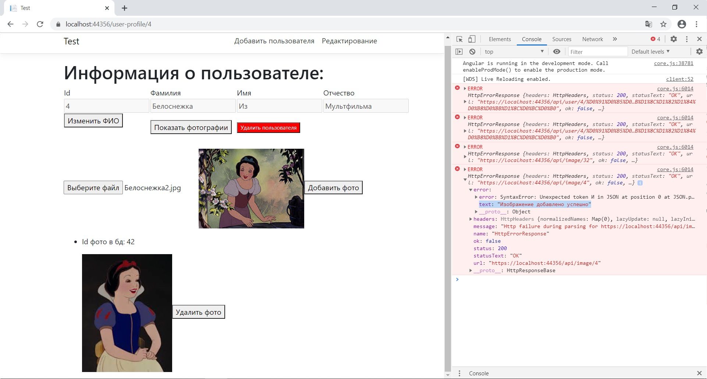

<h2>Добавление фото пользователя, которое уже существует в базе:</h2>
Однако при добавлении изображения, которое уже имеется в базе, будет получен код 400 и сообщение, что такое изображение уже есть.
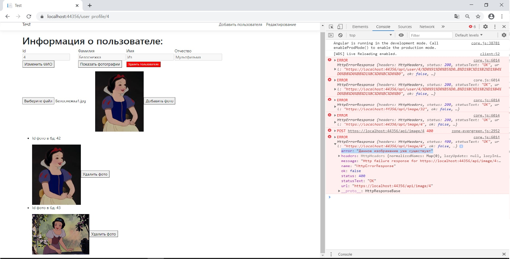

<h2>Удаление пользователя:</h2>
Нажмите на кнопку удалить пользователя, после чего вся информация о нем будет удалена с базы (Id, ФИО, фотографии). (В консоли можно посмотреть результат)
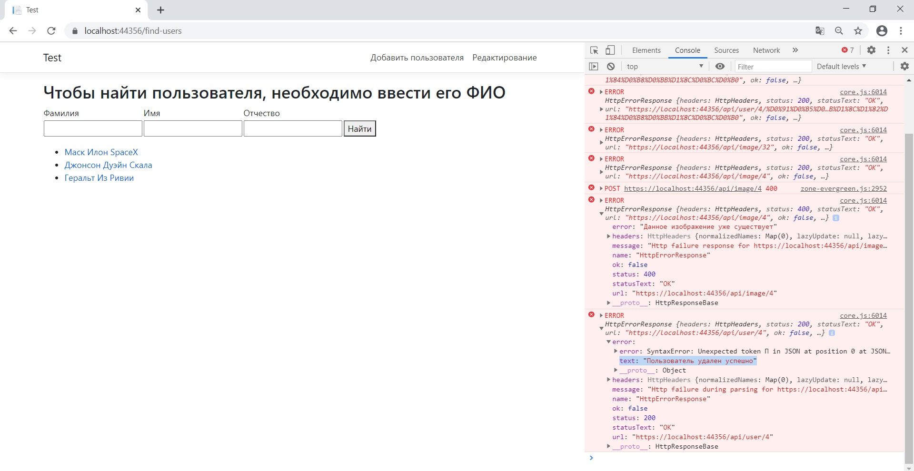

<h2>Добавление нового пользователя:</h2>
Нажмите на кнопку Добавить пользователя (верхний правый угол). После этого заполните ФИО пользователя и нажмите на кнопку Создать пользователя. (Если какое нибудь поле оставить пустым, то оно примет значение Nullable) (В консоли можно посмотреть результат)
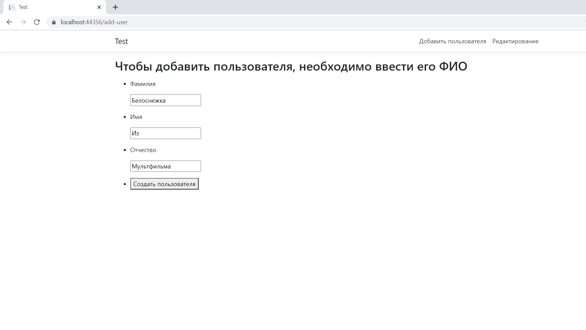
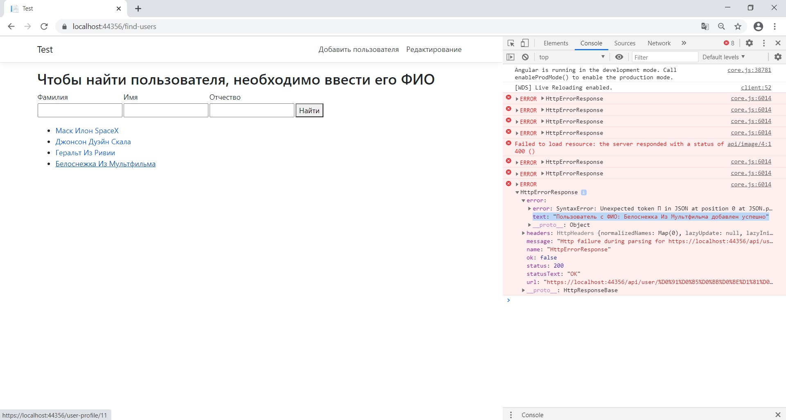

<h2>Хранение данных о пользователях</h2>
Данные хранятся в базе данных, состоящей из 2 таблиц.
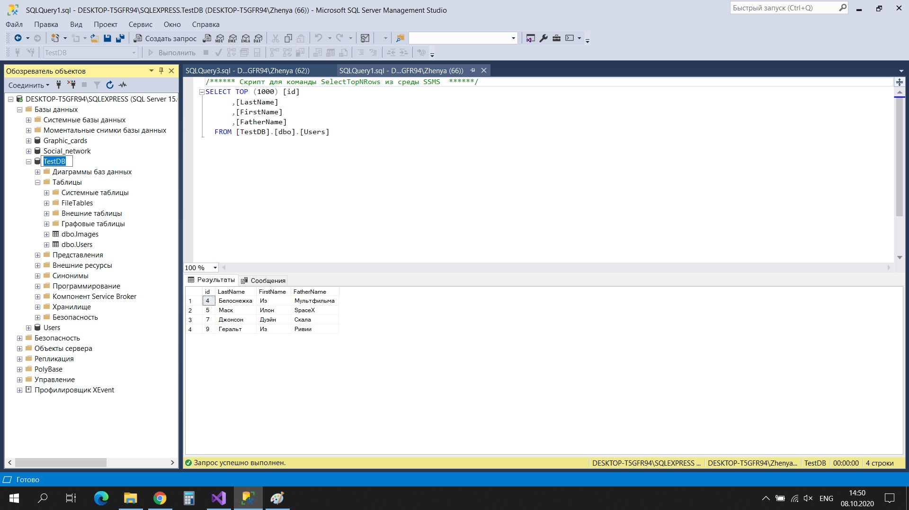
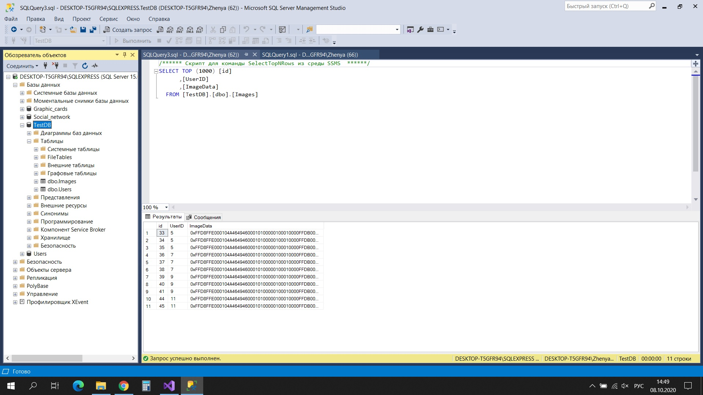
